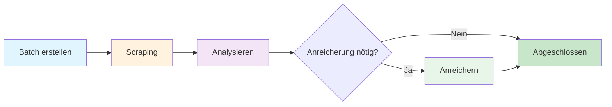

## Einführung

AirOps Batches bietet automatisierte Seitendatenextraktion mit LLM-Anreicherung. Übermitteln Sie URLs und erhalten Sie strukturierte Daten, einschließlich Seitenklassifikation, Autoreninformationen, Veröffentlichungsdaten und Markennennungen.

**Hauptfunktionen:**
- Automatische Klassifikation des Seitentyps
- Extraktion von Autor und Datum
- Erkennung von Markennennungen aus Ihrer bereitgestellten Liste
- Intelligente Lückenanalyse zur Minimierung der Verarbeitungszeit

## Arbeitsablaufphasen

Das Batch durchläuft drei unterschiedliche Phasen:

### Phase 1: Scraping
URLs werden gescraped und geparst, um strukturierte Daten zu extrahieren.

### Phase 2: Analysieren
Die Lückenanalyse bestimmt, welche Felder zusätzliche Extraktion benötigen. Elemente mit vollständigen Daten überspringen die Anreicherung.

### Phase 3: Anreichern
Elemente mit fehlenden Feldern werden über LLM für zusätzliche Extraktion verarbeitet.

## Zielschema

Das System extrahiert diese Felder für jede URL:

| Feld | Typ | Beschreibung |
|------|-----|--------------|
| `page_type` | string | Klassifikation des Seiteninhalts |
| `author` | string | Autor des Inhalts (falls verfügbar) |
| `date_published` | string | Veröffentlichungsdatum (falls verfügbar) |
| `date_modified` | string | Letztes Änderungsdatum (falls verfügbar) |
| `brand_mentions` | array | Marken aus Ihrer Liste, die auf der Seite gefunden wurden |

## Seitentypen

Das Feld `page_type` klassifiziert Seiten in eine dieser Kategorien:

<Accordion title="Alle Seitentypen anzeigen">
- `homepage` - Hauptlandeseite einer Website
- `product_page` - Einzelnes Produkt mit Funktionen/Preisen
- `collection_page` - Mehrere Produkte zusammengefasst
- `pricing_page` - Seite mit dedizierten Preismodellen
- `informational_article` - Standard-Blog-/Informationsinhalt
- `documentation` - Technische Referenz, API-Dokumentation
- `listicle_article` - "Beste von", "Top X" Ranglisten
- `comparison_page` - Nebeneinander-Vergleiche
- `support_article` - FAQ, Fehlerbehebung, Hilfsinhalt
- `review_page` - Produkt-/Dienstleistungsbewertung mit Bewertung
- `forum_thread` - Community-Diskussion oder Q&A
- `social_media_post` - Einzelner sozialer Beitrag
- `social_media_profile` - LinkedIn/Twitter/Instagram-Profilseite
- `video_page` - YouTube, Vimeo, Videoinhalt
- `news_article` - Aktuelle Nachrichten oder Presseberichterstattung
- `case_study` - Erfolgsgeschichte eines Kunden
- `marketplace_listing` - E-Commerce-Produktanzeige
- `landing_page` - Kampagnen-/Konversionsseite (nicht Homepage)
- `deal_page` - Rabatt, Promo, Affiliate-Angebot
- `job_posting` - Stellenanzeigen und Karriereseiten
- `other` - Nicht kategorisiert
</Accordion>

## API-Endpunkte

| Methode | Endpunkt | Beschreibung |
|---------|----------|--------------|
| POST | `/v1/batches-airops` | Neues Batch erstellen |
| GET | `/v1/batches-airops/:batch_id` | Batch-Status abrufen |
| GET | `/v1/batches-airops/:batch_id/items` | Alle Elemente mit Ergebnissen abrufen |