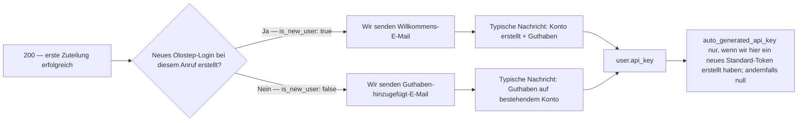
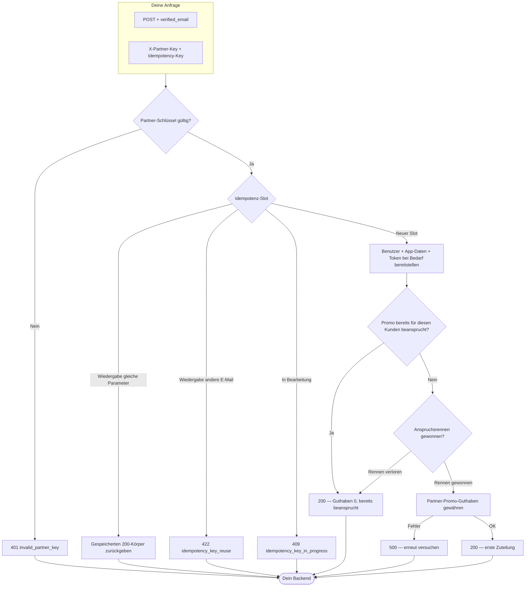

## Überblick

Partner-Benutzer-Schnellverbindung ist ein einzelner `POST`, der ein Olostep-Konto bereitstellt oder anhängt, basierend auf einer E-Mail, die du bereits verifiziert hast.

**Was du sendest**
1. **`X-Partner-Key`** — das Partnerschaftsgeheimnis, das Olostep dir gegeben hat (authentifiziert deine Integration).
2. **`Idempotency-Key`** — ein von dir gewählter Wert, damit Wiederholungen und Wiedergaben sicher sind (siehe die OpenAPI **Beschreibung** für vollständige Regeln).
3. **JSON-Körper** mit **`verified_email`** — die Adresse des Endnutzers, als `Content-Type: application/json`.

**Was auf unserer Seite passieren kann**

- **`200` Erfolg** — Wir lösen oder erstellen den Benutzer, führen die einmalige Partner-Promo-Zuteilung durch, wenn berechtigt, und geben IDs, in diesem Anruf angewendete Guthaben, Nachrichten und API-Schlüssel-Metadaten zurück, wenn relevant. Das umfasst **Erstzuteilungen** (positive **`applied_quick_connect_credits`**), **bereits beansprucht** (Guthaben `0`, keine doppelte Zuteilung) und **idempotente Wiedergabe** (gleicher Schlüssel + gleiche E-Mail gibt den gespeicherten Erfolgsinhalt zurück).
- **Client-Fehler** — Zum Beispiel **`401`**, wenn der Partnerschlüssel falsch oder fehlt, **`400`** für Validierungsprobleme, **`409`**, während derselbe Idempotenzschlüssel noch in Bearbeitung ist, und **`422`**, wenn du einen Idempotenzschlüssel mit einer **anderen** E-Mail als bei der ersten Anfrage wiederverwendest.
- **Serverfehler** — **`500`**, wenn etwas fehlschlägt, nachdem wir die Arbeit akzeptiert haben (z. B. Guthabenzuteilung); Wiederholungen mit demselben `Idempotency-Key` sind angebracht, wenn die Antwort unklar ist.

Sieh dir das OpenAPI-Panel auf dieser Seite an, um Beispielanfragen, Antworten und einen interaktiven Spielplatz zu sehen, um den Schnellverbindungs-Endpunkt auszuprobieren.

---

## Was der Benutzer sieht

Nach einem erfolgreichen **`200`**, verwende das JSON, um dem Kunden einen API-Schlüssel zu geben, wenn wir einen erstellen, und um zu wissen, **ob Olostep ihnen bei diesem Anruf eine Transaktions-E-Mail gesendet hat** (und welches Template).

### API-Zugriff und Dashboard

Kunden können Olosteps APIs **sofort aufrufen, sobald du den Schlüssel hast**—keine Olostep-Website oder Dashboard erforderlich für die API-Nutzung. Gib ihnen **`user.api_key.auto_generated_api_key`**, wenn er **nicht null** ist (wir haben ein Standard-Token bei dieser Zuteilung erstellt); wenn er **`null`** ist, hatten sie bereits Tokens oder es wurde hier kein neues Standard-Token erstellt—sie können einen anderen Schlüssel verwenden oder Schlüssel im Dashboard verwalten (siehe OpenAPI-Beispiele).

Schnellverbindungs-Nutzer **erhalten kein anfängliches Dashboard-Passwort**. Transaktions-E-Mails beinhalten **Setze dein Dashboard-Passwort** (Auth „Passwort vergessen“-Flow) nur für **Anmeldung im Dashboard**—getrennt vom API-Zugriff über den Schlüssel, den du von deinem Backend weitergibst.

### Lesen des `200`-Körpers

| Feld | Was es dir sagt |
|------|-----------------|
| **`applied_quick_connect_credits`** | **Positiv** — erste Partnerzuteilung für diesen Benutzer bei diesem Anruf: Promo-Guthaben angewendet und **genau eine** Transaktions-E-Mail gesendet (siehe **Transaktions-E-Mail** unten). **`0`** — keine neue Zuteilung (normalerweise **bereits beansprucht**): **keine** Willkommens- oder **Partner-Guthaben hinzugefügt**-E-Mail bei **dieser** Antwort; **`user_message`** beschreibt es; **`user.api_key.auto_generated_api_key`** ist **`null`**. |
| **`user.is_new_user`** | Bedeutend, wenn Guthaben **positiv** sind: **`true`** → **Willkommen bei Olostep**; **`false`** → **Partner-Guthaben hinzugefügt**. |
| **`user.api_key.auto_generated_api_key`** | An den Kunden weitergeben, wenn gesetzt; andernfalls auf vorhandene Tokens / Dashboard verlassen. |
| **`user_message`** | Kurzer Ergebnistext für deine Benutzeroberfläche. |
| **Idempotente Wiedergabe** | Gleicher **`Idempotency-Key`** + **`verified_email`** gibt den **gespeicherten** Erfolgsinhalt der ursprünglichen Zuteilung zurück—E-Mails und Schlüssel aus dieser Nutzlast auf die gleiche Weise ableiten. |

### Transaktions-E-Mail

Nur wenn **`applied_quick_connect_credits`** **positiv** ist. **`user.is_new_user`** wählt das Template:

Beide Templates informieren den Kunden, dass **du** den Olostep API-Schlüssel bereitstellst, damit sie starten können, ohne Olostep zuerst zu besuchen, und sie beinhalten die Einrichtung des Dashboard-Passworts für den UI-Zugang.

| Template | Wann (`is_new_user`) | Was der Kunde sieht |
|----------|----------------------|---------------------|
| **Willkommen bei Olostep** | **`true`** | Partnername, Guthabenzeile, **Wie man zugreift** (Schlüssel vom Partner), optionaler Dashboard-Link, Passwort-Setzen-CTA. |
| **Partner-Guthaben hinzugefügt** | **`false`** | Gleiches Guthaben- und Zugriffsmuster für ein **bestehendes** Olostep-Login. |

**Willkommen bei Olostep** (neuer Benutzer):

**Partner-Guthaben hinzugefügt** (bestehender Benutzer):

---

## Anhang

### Vollständiger End-to-End-Fluss

Entscheidungspfade vom Eingang über Idempotenz, Bereitstellung, Affiliate-Anspruch und Guthabenzuteilung (gleiches Verhalten wie der OpenAPI-Vertrag).

