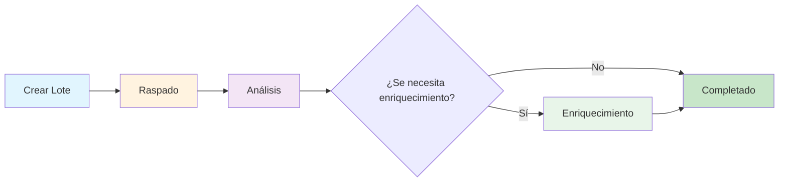

## Introducción

AirOps Batches proporciona extracción automatizada de metadatos de páginas con enriquecimiento LLM. Envía URLs y recibe datos estructurados que incluyen clasificación de páginas, información del autor, fechas de publicación y menciones de marcas.

**Características clave:**
- Clasificación automática del tipo de página
- Extracción de autor y fecha
- Detección de menciones de marca de tu lista proporcionada
- Análisis inteligente de brechas para minimizar el tiempo de procesamiento

## Fases del flujo de trabajo

El lote progresa a través de tres fases distintas:

### Fase 1: Raspado
Las URLs se raspan y analizan para extraer datos estructurados.

### Fase 2: Análisis
El análisis de brechas determina qué campos necesitan extracción adicional. Los elementos con datos completos omiten el enriquecimiento.

### Fase 3: Enriquecimiento
Los elementos con campos faltantes se procesan a través de LLM para extracción adicional.

## Esquema objetivo

El sistema extrae estos campos para cada URL:

| Campo | Tipo | Descripción |
|-------|------|-------------|
| `page_type` | string | Clasificación del contenido de la página |
| `author` | string | Autor del contenido (cuando esté disponible) |
| `date_published` | string | Fecha de publicación (cuando esté disponible) |
| `date_modified` | string | Fecha de última modificación (cuando esté disponible) |
| `brand_mentions` | array | Marcas de tu lista encontradas en la página |

## Tipos de página

El campo `page_type` clasifica las páginas en una de estas categorías:

<Accordion title="Ver todos los tipos de página">
- `homepage` - Página principal de un sitio web
- `product_page` - Producto individual con características/precios
- `collection_page` - Múltiples productos agrupados
- `pricing_page` - Página dedicada a niveles de precios
- `informational_article` - Contenido estándar de blog/información
- `documentation` - Referencia técnica, documentación API
- `listicle_article` - Listas clasificadas "Lo mejor de", "Top X"
- `comparison_page` - Comparaciones lado a lado
- `support_article` - FAQ, solución de problemas, contenido de ayuda
- `review_page` - Reseña de producto/servicio con calificación
- `forum_thread` - Discusión comunitaria o Q&A
- `social_media_post` - Publicación individual en redes sociales
- `social_media_profile` - Página de perfil de LinkedIn/Twitter/Instagram
- `video_page` - Contenido de video de YouTube, Vimeo
- `news_article` - Noticias o cobertura de prensa oportuna
- `case_study` - Historia de éxito del cliente
- `marketplace_listing` - Listado de productos de comercio electrónico
- `landing_page` - Página de campaña/conversión (no página principal)
- `deal_page` - Descuento, promoción, oferta de afiliado
- `job_posting` - Listados de empleo y páginas de carrera
- `other` - No categorizado
</Accordion>

## Puntos finales de la API

| Método | Punto final | Descripción |
|--------|-------------|-------------|
| POST | `/v1/batches-airops` | Crear nuevo lote |
| GET | `/v1/batches-airops/:batch_id` | Obtener estado del lote |
| GET | `/v1/batches-airops/:batch_id/items` | Obtener todos los elementos con resultados |