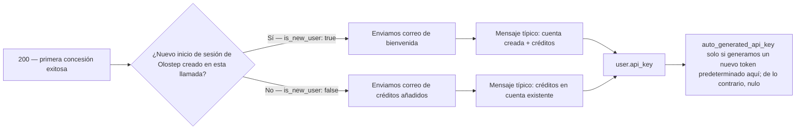
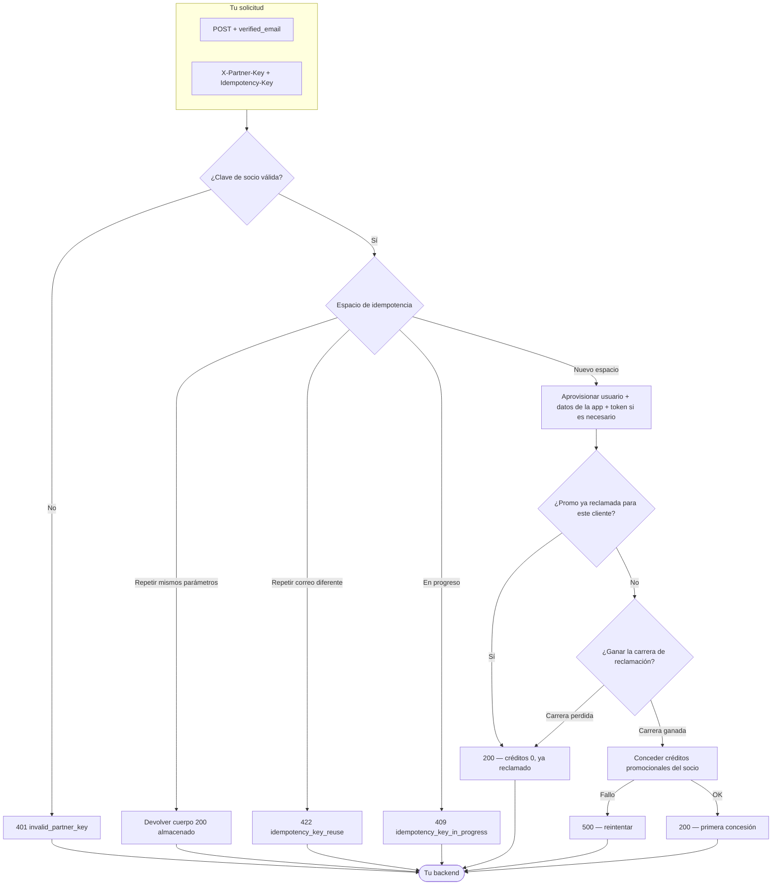

## Descripción General

La Conexión Rápida de Usuario de Socio es un único `POST` que aprovisiona o adjunta una cuenta de Olostep a partir de un correo electrónico que ya has verificado.

**Qué envías**
1. **`X-Partner-Key`** — el secreto de la asociación que Olostep te dio (autentica tu integración).
2. **`Idempotency-Key`** — un valor que eliges para que los reintentos y repeticiones sean seguros (consulta la **Descripción** de OpenAPI para conocer todas las reglas).
3. **Cuerpo JSON** con **`verified_email`** — la dirección del usuario final, como `Content-Type: application/json`.

**Qué puede suceder de nuestro lado**

- **`200` éxito** — Resolvemos o creamos el usuario, ejecutamos la concesión promocional única del socio cuando sea elegible, y devolvemos IDs, créditos aplicados en esta llamada, mensajes y metadatos de la clave API cuando sea relevante. Eso incluye **concesiones por primera vez** (positivo **`applied_quick_connect_credits`**), **ya reclamado** (créditos `0`, sin concesión duplicada), y **repetición idempotente** (misma clave + mismo correo electrónico devuelve el cuerpo de éxito almacenado).
- **Errores del cliente** — Por ejemplo **`401`** si la clave del socio es incorrecta o falta, **`400`** por problemas de validación, **`409`** mientras la misma clave de idempotencia sigue en proceso, y **`422`** si reutilizas una clave de idempotencia con un correo electrónico **diferente** al de la primera solicitud.
- **Errores del servidor** — **`500`** cuando algo falla después de que aceptamos el trabajo (por ejemplo, la concesión de crédito); los reintentos con la **misma** `Idempotency-Key` son apropiados cuando la respuesta no está clara.

Consulta el panel de OpenAPI en esta página para ver solicitudes de ejemplo, respuestas y un entorno interactivo para probar el endpoint de Conexión Rápida.

---

## Lo que ve el usuario

Después de un **`200`** exitoso, usa el JSON para proporcionar al cliente una clave API cuando la generemos y para saber **si Olostep les envió un correo electrónico transaccional en esta llamada** (y qué plantilla).

### Acceso a la API y panel de control

Los clientes pueden llamar a las APIs de Olostep **tan pronto como tengas la clave**—no se requiere el sitio web de Olostep ni el panel de control para el uso de la API. Proporciónales **`user.api_key.auto_generated_api_key`** cuando no sea **nulo** (generamos un token predeterminado en esta concesión); cuando sea **`null`**, ya tenían tokens o no se creó un nuevo predeterminado aquí—pueden usar otra clave o gestionar claves en el panel de control (ver ejemplos de OpenAPI).

Los usuarios de conexión rápida **no reciben una contraseña inicial para el panel de control**. Los correos electrónicos transaccionales incluyen **Configura tu contraseña del panel de control** (flujo de “olvidé mi contraseña” de autenticación) solo para **iniciar sesión en el panel de control**—separado del acceso a la API a través de la clave que pasas desde tu backend.

### Leyendo el cuerpo `200`

| Campo | Lo que te dice |
|-------|----------------|
| **`applied_quick_connect_credits`** | **Positivo** — primera concesión del socio para este usuario en esta llamada: créditos promocionales aplicados y **exactamente un** correo electrónico transaccional enviado (ver **Correo electrónico transaccional** a continuación). **`0`** — sin nueva concesión (normalmente **ya reclamado**): **sin** correo de bienvenida o **Créditos de socio añadidos** en **esta** respuesta; **`user_message`** lo describe; **`user.api_key.auto_generated_api_key`** es **`null`**. |
| **`user.is_new_user`** | Significativo cuando los créditos son **positivos**: **`true`** → **Bienvenido a Olostep**; **`false`** → **Créditos de socio añadidos**. |
| **`user.api_key.auto_generated_api_key`** | Pasa al cliente cuando está establecido; de lo contrario, confía en los tokens existentes / panel de control. |
| **`user_message`** | Texto corto del resultado para tu UI. |
| **Repetición idempotente** | Misma **`Idempotency-Key`** + **`verified_email`** devuelve el cuerpo de éxito **almacenado** de la concesión original—infiera correos electrónicos y claves de esa carga útil de la misma manera. |

### Correo electrónico transaccional

Solo cuando **`applied_quick_connect_credits`** es **positivo**. **`user.is_new_user`** selecciona la plantilla:

Ambas plantillas informan al cliente que **tú** proporcionas la clave API de Olostep para que puedan comenzar sin visitar Olostep primero, e incluyen la configuración de la contraseña del panel de control para el acceso a la UI.

| Plantilla | Cuándo (`is_new_user`) | Lo que ve el cliente |
|-----------|------------------------|----------------------|
| **Bienvenido a Olostep** | **`true`** | Nombre del socio, línea de créditos, **Cómo acceder** (clave del socio), enlace opcional al panel de control, CTA para establecer contraseña. |
| **Créditos de socio añadidos** | **`false`** | Mismo patrón de créditos y acceso para un inicio de sesión de Olostep **existente**. |

**Bienvenido a Olostep** (usuario nuevo):

**Créditos de socio añadidos** (usuario existente):

---

## Apéndice

### Flujo completo de extremo a extremo

Rutas de decisión desde el ingreso a través de la idempotencia, aprovisionamiento, reclamación de afiliado y concesión de crédito (mismo comportamiento que el contrato de OpenAPI).

