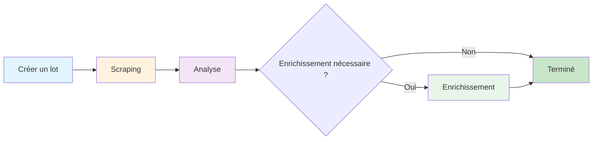

## Introduction

AirOps Batches offre une extraction automatisée des métadonnées de page avec enrichissement LLM. Soumets des URLs et reçois des données structurées incluant la classification des pages, les informations sur l'auteur, les dates de publication, et les mentions de marques.

**Fonctionnalités clés :**
- Classification automatique du type de page
- Extraction de l'auteur et de la date
- Détection des mentions de marque à partir de ta liste fournie
- Analyse intelligente des lacunes pour minimiser le temps de traitement

## Phases du flux de travail

Le lot progresse à travers trois phases distinctes :

### Phase 1 : Scraping
Les URLs sont extraites et analysées pour obtenir des données structurées.

### Phase 2 : Analyse
L'analyse des lacunes détermine quels champs nécessitent une extraction supplémentaire. Les éléments avec des données complètes sautent l'enrichissement.

### Phase 3 : Enrichissement
Les éléments avec des champs manquants sont traités via LLM pour une extraction supplémentaire.

## Schéma cible

Le système extrait ces champs pour chaque URL :

| Champ | Type | Description |
|-------|------|-------------|
| `page_type` | string | Classification du contenu de la page |
| `author` | string | Auteur du contenu (lorsque disponible) |
| `date_published` | string | Date de publication (lorsque disponible) |
| `date_modified` | string | Date de dernière modification (lorsque disponible) |
| `brand_mentions` | array | Marques de ta liste trouvées sur la page |

## Types de pages

Le champ `page_type` classe les pages dans l'une de ces catégories :

<Accordion title="Voir tous les types de pages">
- `homepage` - Page d'accueil principale d'un site web
- `product_page` - Produit individuel avec caractéristiques/prix
- `collection_page` - Plusieurs produits regroupés ensemble
- `pricing_page` - Page dédiée aux niveaux de prix
- `informational_article` - Contenu de blog/information standard
- `documentation` - Référence technique, docs API
- `listicle_article` - Listes classées "Meilleur de", "Top X"
- `comparison_page` - Comparaisons côte à côte
- `support_article` - FAQ, dépannage, contenu d'aide
- `review_page` - Avis sur produit/service avec évaluation
- `forum_thread` - Discussion communautaire ou Q&R
- `social_media_post` - Publication sociale individuelle
- `social_media_profile` - Page de profil LinkedIn/Twitter/Instagram
- `video_page` - Contenu vidéo YouTube, Vimeo
- `news_article` - Actualités ou couverture de presse
- `case_study` - Histoire de réussite client
- `marketplace_listing` - Liste de produits e-commerce
- `landing_page` - Page de campagne/conversion (pas page d'accueil)
- `deal_page` - Remise, promo, offre d'affiliation
- `job_posting` - Annonces d'emploi et pages de carrière
- `other` - Non catégorisé
</Accordion>

## Points de terminaison API

| Méthode | Point de terminaison | Description |
|--------|----------------------|-------------|
| POST | `/v1/batches-airops` | Créer un nouveau lot |
| GET | `/v1/batches-airops/:batch_id` | Obtenir le statut du lot |
| GET | `/v1/batches-airops/:batch_id/items` | Obtenir tous les éléments avec résultats |