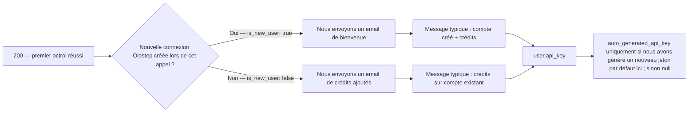
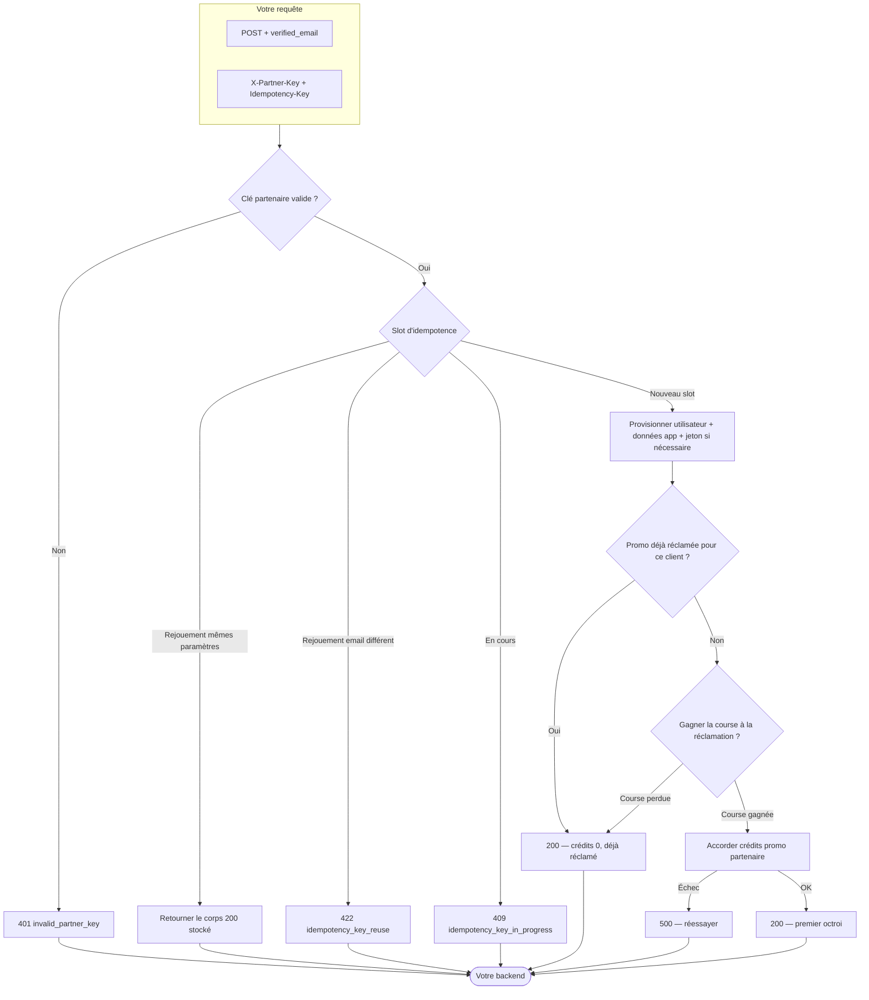

## Aperçu

La Connexion rapide pour utilisateur partenaire est un seul `POST` qui provisionne ou attache un compte Olostep à partir d'un email que vous avez déjà vérifié.

**Ce que vous envoyez**
1. **`X-Partner-Key`** — le secret de partenariat qu'Olostep vous a donné (authentifie votre intégration).
2. **`Idempotency-Key`** — une valeur que vous choisissez pour que les réessais et les rejouements soient sûrs (voir la **Description** OpenAPI pour les règles complètes).
3. **Corps JSON** avec **`verified_email`** — l'adresse de l'utilisateur final, en tant que `Content-Type: application/json`.

**Ce qui peut se passer de notre côté**

- **Succès `200`** — Nous résolvons ou créons l'utilisateur, exécutons l'octroi promotionnel partenaire unique lorsque éligible, et renvoyons les identifiants, les crédits appliqués dans cet appel, la messagerie, et les métadonnées de la clé API lorsque pertinent. Cela inclut **les octrois de première fois** (positif **`applied_quick_connect_credits`**), **déjà réclamé** (crédits `0`, pas de double octroi), et **rejouement idempotent** (même clé + même email renvoie le corps de succès stocké).
- **Erreurs client** — Par exemple **`401`** si la clé partenaire est incorrecte ou manquante, **`400`** pour des problèmes de validation, **`409`** pendant que la même clé d'idempotence est encore en cours, et **`422`** si vous réutilisez une clé d'idempotence avec un email **différent** de la première requête.
- **Erreurs serveur** — **`500`** lorsque quelque chose échoue après que nous ayons accepté le travail (par exemple, l'octroi de crédits) ; les réessais avec la **même** `Idempotency-Key` sont appropriés lorsque la réponse est incertaine.

Consultez le panneau OpenAPI sur cette page pour des exemples de requêtes, de réponses, et un espace de jeu interactif pour essayer le point de terminaison Quick-Connect.

---

## Ce que l'utilisateur voit

Après un succès **`200`**, utilisez le JSON pour donner au client une clé API lorsque nous en générons une et pour savoir **si Olostep leur a envoyé un email transactionnel lors de cet appel** (et quel modèle).

### Accès API et tableau de bord

Les clients peuvent appeler les API d'Olostep **dès que vous avez la clé**—pas besoin du site web ou du tableau de bord d'Olostep pour l'utilisation de l'API. Donnez-leur **`user.api_key.auto_generated_api_key`** lorsqu'il est **non-null** (nous avons généré un jeton par défaut lors de cet octroi) ; lorsqu'il est **`null`**, ils avaient déjà des jetons ou aucun nouveau par défaut n'a été créé ici—ils peuvent utiliser une autre clé ou gérer les clés dans le tableau de bord (voir les exemples OpenAPI).

Les utilisateurs de Quick-connect **ne reçoivent pas de mot de passe initial pour le tableau de bord**. Les emails transactionnels incluent **Définissez votre mot de passe de tableau de bord** (flux d'authentification "mot de passe oublié") pour **se connecter uniquement au tableau de bord**—séparé de l'accès API via la clé que vous transmettez depuis votre backend.

### Lecture du corps `200`

| Champ | Ce qu'il vous dit |
|-------|-------------------|
| **`applied_quick_connect_credits`** | **Positif** — premier octroi partenaire pour cet utilisateur lors de cet appel : crédits promotionnels appliqués et **exactement un** email transactionnel envoyé (voir **Email transactionnel** ci-dessous). **`0`** — pas de nouvel octroi (généralement **déjà réclamé**) : **pas** de bienvenue ou d'email **Crédits partenaires ajoutés** sur **cette** réponse ; **`user_message`** le décrit ; **`user.api_key.auto_generated_api_key`** est **`null`**. |
| **`user.is_new_user`** | Significatif lorsque les crédits sont **positifs** : **`true`** → **Bienvenue chez Olostep** ; **`false`** → **Crédits partenaires ajoutés**. |
| **`user.api_key.auto_generated_api_key`** | Transmettez au client lorsqu'il est défini ; sinon, comptez sur les jetons existants / tableau de bord. |
| **`user_message`** | Texte court de résultat pour votre interface utilisateur. |
| **Rejouement idempotent** | Même **`Idempotency-Key`** + **`verified_email`** renvoie le corps de succès **stocké** de l'octroi original—déduisez les emails et les clés de cette charge utile de la même manière. |

### Email transactionnel

Seulement lorsque **`applied_quick_connect_credits`** est **positif**. **`user.is_new_user`** sélectionne le modèle :

Les deux modèles indiquent au client que **vous** fournissez la clé API Olostep pour qu'ils puissent commencer sans visiter Olostep d'abord, et ils incluent la configuration du mot de passe du tableau de bord pour l'accès à l'interface utilisateur.

| Modèle | Quand (`is_new_user`) | Ce que le client voit |
|--------|-----------------------|-----------------------|
| **Bienvenue chez Olostep** | **`true`** | Nom du partenaire, ligne de crédits, **Comment accéder** (clé du partenaire), lien vers le tableau de bord optionnel, CTA pour définir le mot de passe. |
| **Crédits partenaires ajoutés** | **`false`** | Même modèle de crédit et d'accès pour une connexion Olostep **existante**. |

**Bienvenue chez Olostep** (nouvel utilisateur) :

**Crédits partenaires ajoutés** (utilisateur existant) :

---

## Annexe

### Flux complet de bout en bout

Chemins de décision depuis l'entrée jusqu'à l'idempotence, le provisionnement, la réclamation affiliée, et l'octroi de crédits (même comportement que le contrat OpenAPI).

