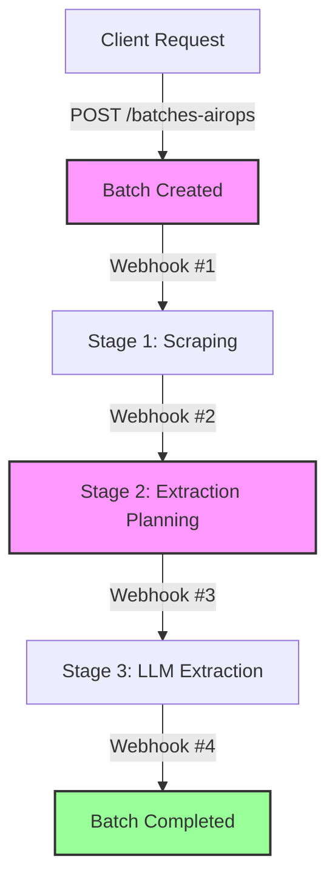

## Introduction

AirOps Batches is a high-level wrapper around the standard `/batches` endpoint. It adds automated LLM-based field extraction for items that cannot be fully parsed by standard scrapers, providing a "best-of-both-worlds" approach: fast rule-based parsing combined with high-accuracy LLM fallback.

## Lifecycle Flow

The lifecycle of an AirOps batch is managed through a series of stages. As a user, you interact with the system by sending an initial request and receiving webhooks as the batch progresses through these stages.

## Input & Output

### Your Input
To start the process, you provide:
1.  **Items**: A list of URLs and your own `custom_id` for each.
2.  **Schema**: A JSON Schema defining the fields you want to extract.
3.  **Webhook**: A single URL to receive all progress updates for this request.

### Our Output
The system provides:
1.  **Unified Status Object**: A comprehensive view of the batch progress, included in every API response and webhook payload.
2.  **Merged Data**: The final result combines the speed of rule-based parsing with the intelligence of LLM extraction.

## Webhooks

All updates for a specific batch are sent to the **same webhook destination** provided in your initial `POST /batches-airops` request. AirOps fires four distinct webhook events during the lifecycle:

<AccordionGroup>
  <Accordion title="1. Batch Created (batch.created)" icon="file-plus">
    Fired immediately after the initial `/batches` call confirms the request is accepted.
    
    **Payload Highlights:**
    - `status.overall`: `in_progress`
    - `status.scraping.status`: `in_progress`
    - `status.extraction.status`: `pending`
  </Accordion>

  <Accordion title="2. Scraping Complete (scraping.complete)" icon="broom">
    Sent when the initial rule-based parsing phase is finished for all items.
    
    **Payload Highlights:**
    - `status.scraping.status`: `completed`
    - `status.scraping.result`: Summary of completed vs failed URLs.
    - `status.extraction.status`: `in_progress`
  </Accordion>

  <Accordion title="3. Enrichment Planned (enrichment.planned)" icon="map">
    Sent after the system identifies missing fields and plans the LLM extraction.
    
    **Payload Highlights:**
    - `enrichment_plan`: Contains `total_items`, `items_needing_enrichment`, and a `field_gap_counts` map showing which fields require LLM extraction.
  </Accordion>

  <Accordion title="4. Extraction Complete (batch.completed)" icon="check-double">
    The final notification sent after LLM results are merged.
    
    **Payload Highlights:**
    - `status.overall`: `completed`
    - `status.extraction.status`: `completed`
    - `status.extraction.result`: Detailed stats including `items_processed`, `items_extracted`, and the `model` used.
  </Accordion>
</AccordionGroup>

## Unified Status Object

Every response and webhook contains a **unified status object** showing all stages and their current states.

### Status Values

| Status | Description |
|--------|-------------|
| `pending` | Not started yet |
| `in_progress` | Currently running |
| `completed` | Finished successfully |
| `failed` | Finished with error |
| `cancelled` | Skipped due to upstream failure |

