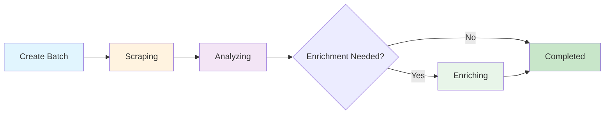

## Introduction

AirOps Batches provides automated page metadata extraction with LLM enrichment. Submit URLs and receive structured data including page classification, author information, publication dates, and brand mentions.

**Key Features:**
- Automatic page type classification
- Author and date extraction
- Brand mention detection from your provided list
- Smart gap analysis to minimize processing time

## Workflow Phases

The batch progresses through three distinct phases:

### Phase 1: Scraping
URLs are scraped and parsed to extract structured data.

### Phase 2: Analyzing
Gap analysis determines which fields need additional extraction. Items with complete data skip enrichment.

### Phase 3: Enriching
Items with missing fields are processed via LLM for additional extraction.

## Target Schema

The system extracts these fields for each URL:

| Field | Type | Description |
|-------|------|-------------|
| `page_type` | string | Classification of the page content |
| `author` | string | Author of the content (when available) |
| `date_published` | string | Publication date (when available) |
| `date_modified` | string | Last modification date (when available) |
| `brand_mentions` | array | Brands from your list found on the page |

## Page Types

The `page_type` field classifies pages into one of these categories:

<Accordion title="View all page types">
- `homepage` - Main landing page of a website
- `product_page` - Individual product with features/pricing
- `collection_page` - Multiple products grouped together
- `pricing_page` - Dedicated pricing tiers page
- `informational_article` - Standard blog/informational content
- `documentation` - Technical reference, API docs
- `listicle_article` - "Best of," "Top X" ranked lists
- `comparison_page` - Side-by-side comparisons
- `support_article` - FAQ, troubleshooting, help content
- `review_page` - Product/service review with rating
- `forum_thread` - Community discussion or Q&A
- `social_media_post` - Individual social post
- `social_media_profile` - LinkedIn/Twitter/Instagram profile page
- `video_page` - YouTube, Vimeo, video content
- `news_article` - Timely news or press coverage
- `case_study` - Customer success story
- `marketplace_listing` - E-commerce product listing
- `landing_page` - Campaign/conversion page (not homepage)
- `deal_page` - Discount, promo, affiliate deal
- `job_posting` - Job listings and career pages
- `other` - Uncategorized
</Accordion>

## API Endpoints

| Method | Endpoint | Description |
|--------|----------|-------------|
| POST | `/v1/batches-airops` | Create new batch |
| GET | `/v1/batches-airops/:batch_id` | Get batch status |
| GET | `/v1/batches-airops/:batch_id/items` | Get all items with results |
