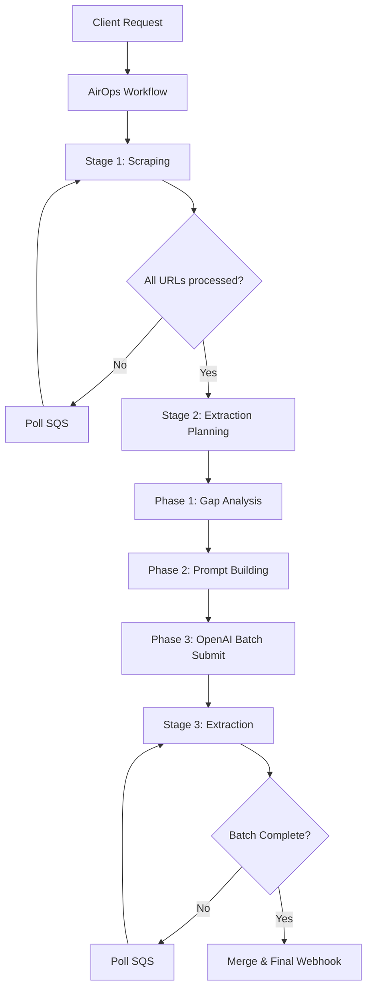

## Introduction

AirOps Batches is a high-level wrapper around the standard `/batches` endpoint. It adds automated LLM-based field extraction for items that cannot be fully parsed by standard scrapers, providing a "best-of-both-worlds" approach: fast rule-based parsing combined with high-accuracy LLM fallback.

## Architecture

The system follows a staged execution model where each stage is monitored via a unified status object.



## Unified Status Object

Every response and webhook contains a **unified status object** showing all stages and their states. This provides a complete view of the batch at any point in time.

### Structure

```json
{
  "id": "batch_x7f2k",
  "object": "batch",
  "created": 1736676000000,
  "total_urls": 100,
  "status": {
    "overall": "in_progress",
    "scraping": {
      "status": "completed",
      "started_at": 1736676000000,
      "completed_at": 1736676045000,
      "result": {
        "completed_urls": 98,
        "failed_urls": 2
      }
    },
    "extraction": {
      "status": "in_progress",
      "started_at": 1736676045000,
      "completed_at": null,
      "result": null
    }
  }
}
```

### Status Values

| Status | Description |
|--------|-------------|
| `pending` | Not started yet |
| `in_progress` | Currently running |
| `completed` | Finished successfully |
| `failed` | Finished with error |
| `cancelled` | Skipped due to upstream failure |

## Polling & Stage Detection

Since AirOps Batches wraps the existing batches codebase without modifying it, it uses **SQS-based polling** to detect stage completion.

1.  **Scraping Poll**: Triggers every 2 minutes. Checks DynamoDB for item count vs `total_urls`.
2.  **Extraction Poll**: Triggers every 5 minutes. Checks OpenAI Batch API status.

If a stage is not complete, the poller self-schedules another check with a delay.

## Webhooks

AirOps fires four distinct webhook events during the lifecycle:

1.  **Batch Created**: Fired immediately after the initial `/batches` call.
2.  **Scraping Complete**: Fired when all URLs have been scraped and parsed.
3.  **Enrichment Planned**: Fired after gap analysis completes, containing the `enrichment_plan`.
4.  **Extraction Complete**: Fired after LLM results are merged (Final).

