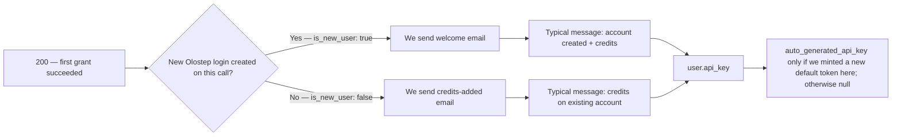
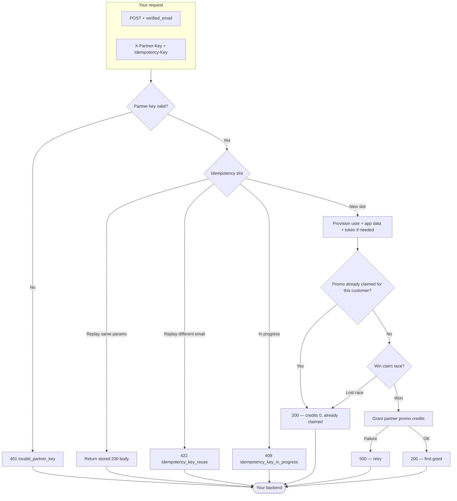

## Overview

Partner User Quick-Connect is a single `POST` that provisions or attaches an Olostep account from an email you have already verified.

**What you send**
1. **`X-Partner-Key`** — the partnership secret Olostep gave you (authenticates your integration).
2. **`Idempotency-Key`** — a value you choose so retries and replays are safe (see the OpenAPI **Description** for full rules).
3. **JSON body** with **`verified_email`** — the end user’s address, as `Content-Type: application/json`.

**What can happen on our side**

- **`200` success** — We resolve or create the user, run the one-time partner promo grant when eligible, and return ids, credits applied in this call, messaging, and API-key metadata when relevant. That includes **first-time grants** (positive **`applied_quick_connect_credits`**), **already claimed** (credits `0`, no duplicate grant), and **idempotent replay** (same key + same email returns the stored success body).
- **Client errors** — For example **`401`** if the partner key is wrong or missing, **`400`** for validation issues, **`409`** while the same idempotency key is still in flight, and **`422`** if you reuse an idempotency key with a **different** email than the first request.
- **Server errors** — **`500`** when something fails after we accepted the work (e.g. credit grant); retries with the **same** `Idempotency-Key` are appropriate when the response is unclear.

Check out the OpenAPI panel on this page for sample requests, responses, and an interactive playground to try the Quick-Connect endpoint.

---

## What the user sees

After a successful **`200`**, use the JSON to give the customer an API key when we mint one and to know **whether Olostep sent them a transactional email on this call** (and which template).

### API access and dashboard

Customers can call Olostep’s APIs **as soon as you have the key**—no Olostep website or dashboard required for API usage. Give them **`user.api_key.auto_generated_api_key`** when it is **non-null** (we minted a default token on this grant); when it is **`null`**, they already had tokens or no new default was created here—they can use another key or manage keys in the dashboard (see OpenAPI examples).

Quick-connect users **do not receive an initial dashboard password**. Transactional emails include **Set your dashboard password** (auth “forgot password” flow) for **sign-in to the dashboard only**—separate from API access via the key you pass from your backend.

### Reading the `200` body

| Field | What it tells you |
|-------|-------------------|
| **`applied_quick_connect_credits`** | **Positive** — first partner grant for this user on this call: promo credits applied and **exactly one** transactional email sent (see **Transactional email** below). **`0`** — no new grant (usually **already claimed**): **no** welcome or **Partner credits added** email on **this** response; **`user_message`** describes it; **`user.api_key.auto_generated_api_key`** is **`null`**. |
| **`user.is_new_user`** | Meaningful when credits are **positive**: **`true`** → **Welcome to Olostep**; **`false`** → **Partner credits added**. |
| **`user.api_key.auto_generated_api_key`** | Pass to the customer when set; otherwise rely on existing tokens / dashboard. |
| **`user_message`** | Short outcome text for your UI. |
| **Idempotent replay** | Same **`Idempotency-Key`** + **`verified_email`** returns the **stored** success body from the original grant—infer emails and keys from that payload the same way. |

### Transactional email

Only when **`applied_quick_connect_credits`** is **positive**. **`user.is_new_user`** selects the template:

Both templates tell the customer that **you** supply the Olostep API key so they can start without visiting Olostep first, and they include dashboard password setup for UI access.

| Template | When (`is_new_user`) | What the customer sees |
|----------|----------------------|-------------------------|
| **Welcome to Olostep** | **`true`** | Partner name, credits line, **How to access** (key from partner), optional dashboard link, set-password CTA. |
| **Partner credits added** | **`false`** | Same credit and access pattern for an **existing** Olostep login. |

**Welcome to Olostep** (new user):

**Partner credits added** (existing user):

---

## Appendix

### Full end-to-end flow

Decision paths from ingress through idempotency, provisioning, affiliate claim, and credit grant (same behavior as the OpenAPI contract).

