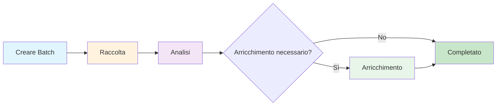

## Introduzione

AirOps Batches fornisce l'estrazione automatica dei metadati delle pagine con arricchimento LLM. Invia URL e ricevi dati strutturati inclusi classificazione della pagina, informazioni sull'autore, date di pubblicazione e menzioni del marchio.

**Caratteristiche principali:**
- Classificazione automatica del tipo di pagina
- Estrazione di autore e data
- Rilevamento delle menzioni del marchio dalla tua lista fornita
- Analisi intelligente delle lacune per ridurre al minimo il tempo di elaborazione

## Fasi del flusso di lavoro

Il batch progredisce attraverso tre fasi distinte:

### Fase 1: Raccolta
Gli URL vengono raccolti e analizzati per estrarre dati strutturati.

### Fase 2: Analisi
L'analisi delle lacune determina quali campi necessitano di un'ulteriore estrazione. Gli elementi con dati completi saltano l'arricchimento.

### Fase 3: Arricchimento
Gli elementi con campi mancanti vengono elaborati tramite LLM per un'ulteriore estrazione.

## Schema di destinazione

Il sistema estrae questi campi per ogni URL:

| Campo | Tipo | Descrizione |
|-------|------|-------------|
| `page_type` | string | Classificazione del contenuto della pagina |
| `author` | string | Autore del contenuto (quando disponibile) |
| `date_published` | string | Data di pubblicazione (quando disponibile) |
| `date_modified` | string | Data dell'ultima modifica (quando disponibile) |
| `brand_mentions` | array | Marchi dalla tua lista trovati sulla pagina |

## Tipi di pagina

Il campo `page_type` classifica le pagine in una di queste categorie:

<Accordion title="Visualizza tutti i tipi di pagina">
- `homepage` - Pagina principale di un sito web
- `product_page` - Prodotto individuale con caratteristiche/prezzi
- `collection_page` - Più prodotti raggruppati insieme
- `pricing_page` - Pagina dedicata ai livelli di prezzo
- `informational_article` - Contenuto standard di blog/informazione
- `documentation` - Riferimento tecnico, documentazione API
- `listicle_article` - Liste classificate "Il meglio di", "Top X"
- `comparison_page` - Confronti affiancati
- `support_article` - FAQ, risoluzione dei problemi, contenuti di aiuto
- `review_page` - Recensione di prodotto/servizio con valutazione
- `forum_thread` - Discussione comunitaria o Q&A
- `social_media_post` - Singolo post sui social
- `social_media_profile` - Pagina profilo LinkedIn/Twitter/Instagram
- `video_page` - Contenuti video YouTube, Vimeo
- `news_article` - Notizie tempestive o copertura stampa
- `case_study` - Storia di successo del cliente
- `marketplace_listing` - Annuncio di prodotto e-commerce
- `landing_page` - Pagina di campagna/conversione (non homepage)
- `deal_page` - Offerta sconto, promozione, affiliazione
- `job_posting` - Annunci di lavoro e pagine di carriera
- `other` - Non categorizzato
</Accordion>

## Endpoint API

| Metodo | Endpoint | Descrizione |
|--------|----------|-------------|
| POST | `/v1/batches-airops` | Creare un nuovo batch |
| GET | `/v1/batches-airops/:batch_id` | Ottenere lo stato del batch |
| GET | `/v1/batches-airops/:batch_id/items` | Ottenere tutti gli elementi con risultati |