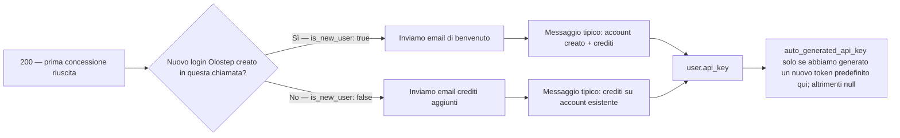
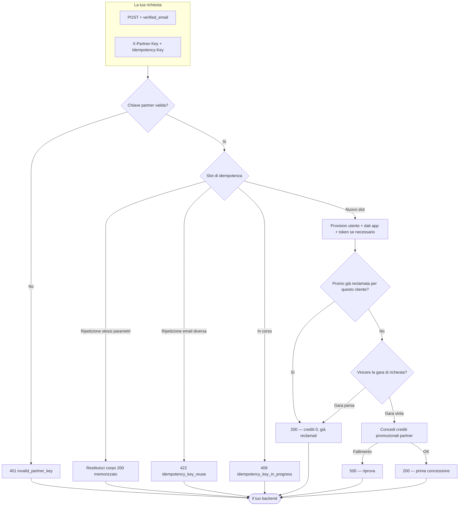

## Panoramica

La Connessione Rapida Utente Partner è un singolo `POST` che fornisce o collega un account Olostep da un'email che hai già verificato.

**Cosa invii**
1. **`X-Partner-Key`** — il segreto della partnership che Olostep ti ha fornito (autentica la tua integrazione).
2. **`Idempotency-Key`** — un valore che scegli per garantire che i tentativi e le ripetizioni siano sicuri (vedi la **Descrizione** di OpenAPI per le regole complete).
3. **Corpo JSON** con **`verified_email`** — l'indirizzo dell'utente finale, come `Content-Type: application/json`.

**Cosa può succedere dalla nostra parte**

- **`200` successo** — Risolviamo o creiamo l'utente, eseguiamo la concessione promozionale partner una tantum quando idonea, e restituiamo ID, crediti applicati in questa chiamata, messaggi e metadati della chiave API quando rilevanti. Ciò include **prime concessioni** (positivo **`applied_quick_connect_credits`**), **già reclamati** (crediti `0`, nessuna concessione duplicata), e **ripetizione idempotente** (stessa chiave + stessa email restituisce il corpo di successo memorizzato).
- **Errori del client** — Ad esempio **`401`** se la chiave partner è errata o mancante, **`400`** per problemi di validazione, **`409`** mentre la stessa chiave di idempotenza è ancora in corso, e **`422`** se riutilizzi una chiave di idempotenza con un'email **diversa** dalla prima richiesta.
- **Errori del server** — **`500`** quando qualcosa fallisce dopo che abbiamo accettato il lavoro (es. concessione del credito); i tentativi con la **stessa** `Idempotency-Key` sono appropriati quando la risposta non è chiara.

Consulta il pannello OpenAPI in questa pagina per richieste di esempio, risposte e un playground interattivo per provare l'endpoint Quick-Connect.

---

## Cosa vede l'utente

Dopo un **`200`** di successo, usa il JSON per fornire al cliente una chiave API quando ne generiamo una e per sapere **se Olostep ha inviato loro un'email transazionale in questa chiamata** (e quale modello).

### Accesso API e dashboard

I clienti possono chiamare le API di Olostep **non appena hai la chiave**—non è richiesto il sito web o il dashboard di Olostep per l'uso dell'API. Fornisci loro **`user.api_key.auto_generated_api_key`** quando è **non-null** (abbiamo generato un token predefinito su questa concessione); quando è **`null`**, avevano già token o non è stato creato un nuovo predefinito qui—possono usare un'altra chiave o gestire le chiavi nel dashboard (vedi esempi OpenAPI).

Gli utenti con connessione rapida **non ricevono una password iniziale per il dashboard**. Le email transazionali includono **Imposta la tua password del dashboard** (flusso di autenticazione "password dimenticata") solo per l'accesso al dashboard—separato dall'accesso API tramite la chiave che passi dal tuo backend.

### Lettura del corpo `200`

| Campo | Cosa ti dice |
|-------|--------------|
| **`applied_quick_connect_credits`** | **Positivo** — prima concessione partner per questo utente in questa chiamata: crediti promozionali applicati e **esattamente una** email transazionale inviata (vedi **Email transazionale** sotto). **`0`** — nessuna nuova concessione (di solito **già reclamati**): **nessuna** email di benvenuto o **Crediti partner aggiunti** in **questa** risposta; **`user_message`** lo descrive; **`user.api_key.auto_generated_api_key`** è **`null`**. |
| **`user.is_new_user`** | Significativo quando i crediti sono **positivi**: **`true`** → **Benvenuto in Olostep**; **`false`** → **Crediti partner aggiunti**. |
| **`user.api_key.auto_generated_api_key`** | Passa al cliente quando impostato; altrimenti affidati ai token esistenti / dashboard. |
| **`user_message`** | Breve testo di risultato per la tua UI. |
| **Ripetizione idempotente** | Stessa **`Idempotency-Key`** + **`verified_email`** restituisce il corpo di successo **memorizzato** dalla concessione originale—deduci email e chiavi da quel payload allo stesso modo. |

### Email transazionale

Solo quando **`applied_quick_connect_credits`** è **positivo**. **`user.is_new_user`** seleziona il modello:

Entrambi i modelli informano il cliente che **tu** fornisci la chiave API di Olostep in modo che possano iniziare senza visitare prima Olostep, e includono l'impostazione della password del dashboard per l'accesso all'interfaccia utente.

| Modello | Quando (`is_new_user`) | Cosa vede il cliente |
|---------|------------------------|----------------------|
| **Benvenuto in Olostep** | **`true`** | Nome del partner, linea dei crediti, **Come accedere** (chiave dal partner), link al dashboard opzionale, CTA per impostare la password. |
| **Crediti partner aggiunti** | **`false`** | Stesso schema di crediti e accesso per un login Olostep **esistente**. |

**Benvenuto in Olostep** (nuovo utente):

**Crediti partner aggiunti** (utente esistente):

---

## Appendice

### Flusso completo end-to-end

Percorsi decisionali dall'ingresso attraverso l'idempotenza, il provisioning, la richiesta di affiliazione e la concessione del credito (stesso comportamento del contratto OpenAPI).

