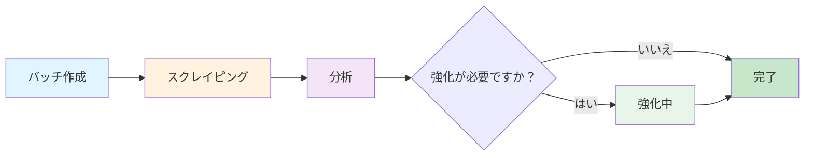

## はじめに

AirOps Batchesは、LLMによる強化を伴う自動ページメタデータ抽出を提供します。URLを送信すると、ページ分類、著者情報、公開日、ブランド言及を含む構造化データを受け取ります。

**主な機能:**
- 自動ページタイプ分類
- 著者と日付の抽出
- 提供されたリストからのブランド言及検出
- 処理時間を最小限に抑えるスマートギャップ分析

## ワークフローフェーズ

バッチは3つの異なるフェーズを経て進行します:

### フェーズ1: スクレイピング
URLがスクレイピングされ、構造化データを抽出するために解析されます。

### フェーズ2: 分析
ギャップ分析により、追加抽出が必要なフィールドを決定します。完全なデータを持つアイテムは強化をスキップします。

### フェーズ3: 強化
欠落フィールドを持つアイテムは、LLMを通じて追加抽出が行われます。

## ターゲットスキーマ

システムは各URLに対して以下のフィールドを抽出します:

| フィールド | タイプ | 説明 |
|-----------|-------|------|
| `page_type` | string | ページコンテンツの分類 |
| `author` | string | コンテンツの著者（利用可能な場合） |
| `date_published` | string | 公開日（利用可能な場合） |
| `date_modified` | string | 最終更新日（利用可能な場合） |
| `brand_mentions` | array | ページ上で見つかったリストからのブランド |

## ページタイプ

`page_type`フィールドはページを以下のカテゴリーのいずれかに分類します:

<Accordion title="すべてのページタイプを表示">
- `homepage` - ウェブサイトのメインランディングページ
- `product_page` - 機能/価格を持つ個別製品
- `collection_page` - 複数の製品がまとめられたページ
- `pricing_page` - 専用の価格設定ページ
- `informational_article` - 標準的なブログ/情報コンテンツ
- `documentation` - 技術リファレンス、APIドキュメント
- `listicle_article` - 「ベストオブ」、「トップX」ランキングリスト
- `comparison_page` - 並べて比較
- `support_article` - FAQ、トラブルシューティング、ヘルプコンテンツ
- `review_page` - 評価付きの製品/サービスレビュー
- `forum_thread` - コミュニティディスカッションまたはQ&A
- `social_media_post` - 個別のソーシャル投稿
- `social_media_profile` - LinkedIn/Twitter/Instagramのプロフィールページ
- `video_page` - YouTube、Vimeo、ビデオコンテンツ
- `news_article` - タイムリーなニュースまたはプレス報道
- `case_study` - 顧客成功事例
- `marketplace_listing` - Eコマース製品リスト
- `landing_page` - キャンペーン/コンバージョンページ（ホームページではない）
- `deal_page` - 割引、プロモーション、アフィリエイトディール
- `job_posting` - 求人情報とキャリアページ
- `other` - 未分類
</Accordion>

## APIエンドポイント

| メソッド | エンドポイント | 説明 |
|---------|---------------|------|
| POST | `/v1/batches-airops` | 新しいバッチを作成 |
| GET | `/v1/batches-airops/:batch_id` | バッチのステータスを取得 |
| GET | `/v1/batches-airops/:batch_id/items` | 結果を持つすべてのアイテムを取得 |