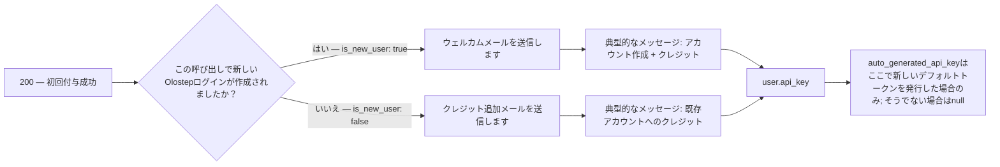
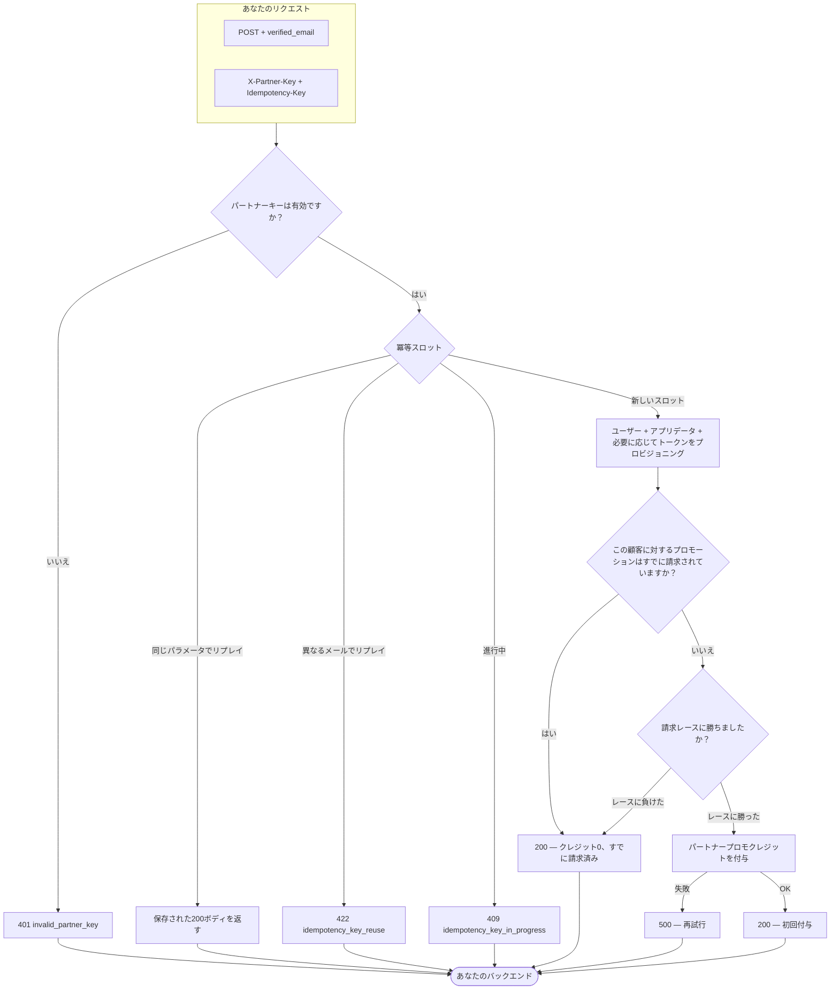

## 概要

パートナー ユーザー クイックコネクトは、すでに確認済みのメールからOlostepアカウントをプロビジョニングまたはアタッチする単一の`POST`です。

**送信するもの**
1. **`X-Partner-Key`** — Olostepが提供したパートナーシップシークレット（統合を認証します）。
2. **`Idempotency-Key`** — 再試行やリプレイが安全であるように選択する値（完全なルールについてはOpenAPIの**説明**を参照）。
3. **`verified_email`**を含む**JSONボディ** — `Content-Type: application/json`としてのエンドユーザーのアドレス。

**私たちの側で起こりうること**

- **`200` 成功** — ユーザーを解決または作成し、適用可能な場合は一度限りのパートナープロモーションを実行し、ID、適用されたクレジット、メッセージング、および関連する場合のAPIキーのメタデータを返します。これには、**初回の付与**（正の**`applied_quick_connect_credits`**）、**すでに請求済み**（クレジット`0`、重複付与なし）、および**冪等リプレイ**（同じキー + 同じメールが保存された成功ボディを返す）が含まれます。
- **クライアントエラー** — たとえば、パートナーキーが間違っているか欠落している場合は**`401`**、バリデーションの問題の場合は**`400`**、同じ冪等キーがまだ進行中の場合は**`409`**、最初のリクエストと異なるメールで冪等キーを再利用した場合は**`422`**。
- **サーバーエラー** — **`500`** は、作業を受け入れた後に何かが失敗した場合（例：クレジット付与）; 応答が不明瞭な場合は、**同じ**`Idempotency-Key`で再試行するのが適切です。

このページのOpenAPIパネルで、サンプルリクエスト、レスポンス、およびクイックコネクトエンドポイントを試すためのインタラクティブなプレイグラウンドを確認してください。

---

## ユーザーが見るもの

**`200`**が成功した後、JSONを使用して顧客にAPIキーを提供し、**この呼び出しでOlostepがトランザクションメールを送信したかどうか**（およびどのテンプレートか）を確認します。

### APIアクセスとダッシュボード

顧客は、**キーを持っている限り**、OlostepのAPIを呼び出すことができます—API使用にはOlostepのウェブサイトやダッシュボードは必要ありません。**`user.api_key.auto_generated_api_key`**が**nullでない**場合に提供します（この付与でデフォルトトークンを発行しました）; **`null`**の場合、すでにトークンを持っているか、ここで新しいデフォルトが作成されなかったことを意味します—別のキーを使用するか、ダッシュボードでキーを管理できます（OpenAPIの例を参照）。

クイックコネクトユーザーは**初期ダッシュボードパスワードを受け取りません**。トランザクションメールには、**ダッシュボードパスワードを設定する**（認証「パスワードを忘れた」フロー）が含まれます—**ダッシュボードへのサインインのみ**で、バックエンドから渡されるキーを介したAPIアクセスとは別です。

### `200`ボディの読み取り

| フィールド | 何を示しているか |
|-------|-------------------|
| **`applied_quick_connect_credits`** | **正** — この呼び出しでこのユーザーに対する初回のパートナー付与: プロモーションクレジットが適用され、**正確に1通の**トランザクションメールが送信されます（**トランザクションメール**を参照）。**`0`** — 新しい付与なし（通常は**すでに請求済み**）: **この**レスポンスでのウェルカムまたは**パートナークレジット追加**メールは**なし**; **`user_message`**がそれを説明します; **`user.api_key.auto_generated_api_key`**は**`null`**です。 |
| **`user.is_new_user`** | クレジットが**正**のときに意味があります: **`true`** → **Olostepへようこそ**; **`false`** → **パートナークレジットが追加されました**。 |
| **`user.api_key.auto_generated_api_key`** | 設定されている場合は顧客に渡します; そうでない場合は既存のトークン/ダッシュボードに依存します。 |
| **`user_message`** | UIのための短い結果テキスト。 |
| **冪等リプレイ** | 同じ**`Idempotency-Key`** + **`verified_email`**が元の付与からの**保存された**成功ボディを返します—そのペイロードからメールとキーを同じ方法で推測します。 |

### トランザクションメール

**`applied_quick_connect_credits`**が**正**の場合のみ。**`user.is_new_user`**がテンプレートを選択します：

両方のテンプレートは、顧客にOlostep APIキーを提供することで、最初にOlostepを訪れることなく開始できることを伝え、UIアクセスのためのダッシュボードパスワード設定を含みます。

| テンプレート | いつ（`is_new_user`） | 顧客が見るもの |
|----------|----------------------|-------------------------|
| **Olostepへようこそ** | **`true`** | パートナー名、クレジットライン、**アクセス方法**（パートナーからのキー）、オプションのダッシュボードリンク、パスワード設定CTA。 |
| **パートナークレジットが追加されました** | **`false`** | **既存**のOlostepログインに対する同じクレジットとアクセスパターン。 |

**Olostepへようこそ**（新規ユーザー）：

**パートナークレジットが追加されました**（既存ユーザー）：

---

## 付録

### エンドツーエンドの完全なフロー

インバウンドから冪等性、プロビジョニング、アフィリエイト請求、クレジット付与までの意思決定パス（OpenAPI契約と同じ動作）。

