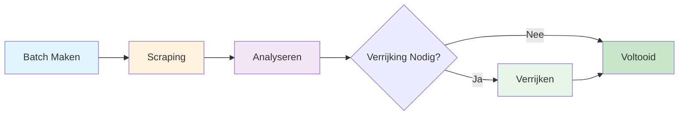

## Introductie

AirOps Batches biedt geautomatiseerde extractie van paginametadata met LLM verrijking. Dien URL's in en ontvang gestructureerde gegevens, inclusief pagina-classificatie, auteurinformatie, publicatiedata en merkvermeldingen.

**Belangrijkste Kenmerken:**
- Automatische classificatie van paginatypes
- Extractie van auteur en datum
- Detectie van merkvermeldingen uit je opgegeven lijst
- Slimme gap-analyse om verwerkingstijd te minimaliseren

## Workflow Fasen

De batch doorloopt drie verschillende fasen:

### Fase 1: Scraping
URL's worden gescraped en geparsed om gestructureerde gegevens te extraheren.

### Fase 2: Analyseren
Gap-analyse bepaalt welke velden extra extractie nodig hebben. Items met volledige gegevens slaan verrijking over.

### Fase 3: Verrijken
Items met ontbrekende velden worden verwerkt via LLM voor extra extractie.

## Doelschema

Het systeem extraheert deze velden voor elke URL:

| Veld | Type | Beschrijving |
|------|------|--------------|
| `page_type` | string | Classificatie van de pagina-inhoud |
| `author` | string | Auteur van de inhoud (indien beschikbaar) |
| `date_published` | string | Publicatiedatum (indien beschikbaar) |
| `date_modified` | string | Laatste wijzigingsdatum (indien beschikbaar) |
| `brand_mentions` | array | Merken uit je lijst gevonden op de pagina |

## Paginatypes

Het `page_type` veld classificeert pagina's in een van deze categorieën:

<Accordion title="Bekijk alle paginatypes">
- `homepage` - Hoofdpagina van een website
- `product_page` - Individueel product met functies/prijzen
- `collection_page` - Meerdere producten gegroepeerd
- `pricing_page` - Toegewijde prijspagina
- `informational_article` - Standaard blog/informatieve inhoud
- `documentation` - Technische referentie, API-documentatie
- `listicle_article` - "Beste van," "Top X" gerangschikte lijsten
- `comparison_page` - Vergelijkingen naast elkaar
- `support_article` - FAQ, probleemoplossing, helpinhoud
- `review_page` - Product/dienst beoordeling met beoordeling
- `forum_thread` - Gemeenschapsdiscussie of Q&A
- `social_media_post` - Individuele sociale post
- `social_media_profile` - LinkedIn/Twitter/Instagram profielpagina
- `video_page` - YouTube, Vimeo, videocontent
- `news_article` - Actueel nieuws of persbericht
- `case_study` - Klantsuccesverhaal
- `marketplace_listing` - E-commerce productvermelding
- `landing_page` - Campagne/conversiepagina (niet hoofdpagina)
- `deal_page` - Korting, promotie, affiliate deal
- `job_posting` - Vacatures en carrièrepagina's
- `other` - Niet-gecategoriseerd
</Accordion>

## API Eindpunten

| Methode | Eindpunt | Beschrijving |
|---------|----------|--------------|
| POST | `/v1/batches-airops` | Nieuwe batch maken |
| GET | `/v1/batches-airops/:batch_id` | Batchstatus ophalen |
| GET | `/v1/batches-airops/:batch_id/items` | Alle items met resultaten ophalen |