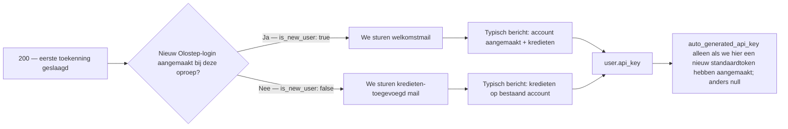
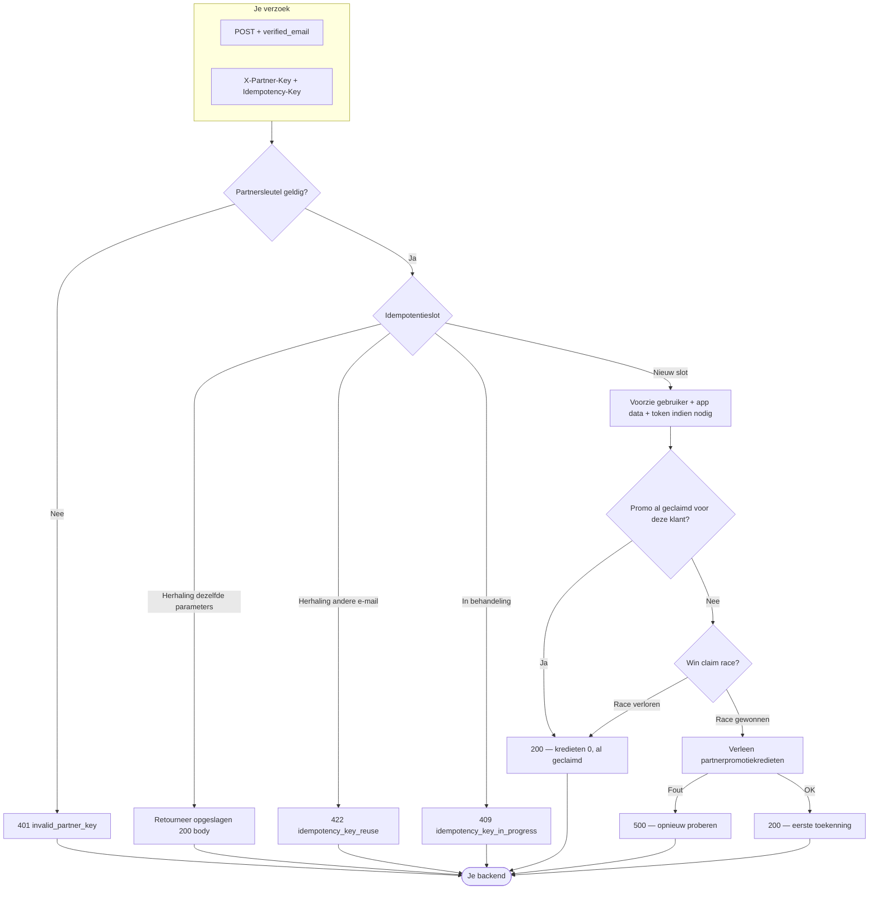

## Overzicht

Partnergebruikers Snel-Verbinden is een enkele `POST` die een Olostep-account verstrekt of koppelt aan een e-mail die je al hebt geverifieerd.

**Wat je verstuurt**
1. **`X-Partner-Key`** — het partnerschapsgeheim dat Olostep je heeft gegeven (authenticeert je integratie).
2. **`Idempotency-Key`** — een waarde die je kiest zodat herhalingen en heruitvoeringen veilig zijn (zie de OpenAPI **Beschrijving** voor volledige regels).
3. **JSON-body** met **`verified_email`** — het adres van de eindgebruiker, als `Content-Type: application/json`.

**Wat er aan onze kant kan gebeuren**

- **`200` succes** — We lossen de gebruiker op of maken deze aan, voeren de eenmalige partnerpromotie uit indien van toepassing, en retourneren ID's, toegepaste kredieten in deze oproep, berichten en API-sleutelmetadata indien relevant. Dat omvat **eerste toekenningen** (positieve **`applied_quick_connect_credits`**), **al geclaimd** (kredieten `0`, geen dubbele toekenning), en **idempotente herhaling** (dezelfde sleutel + dezelfde e-mail retourneert de opgeslagen succesbody).
- **Clientfouten** — Bijvoorbeeld **`401`** als de partnersleutel verkeerd is of ontbreekt, **`400`** voor validatieproblemen, **`409`** terwijl dezelfde idempotentiesleutel nog in behandeling is, en **`422`** als je een idempotentiesleutel hergebruikt met een **andere** e-mail dan de eerste aanvraag.
- **Serverfouten** — **`500`** wanneer er iets misgaat nadat we het werk hebben geaccepteerd (bijvoorbeeld krediettoekenning); herhalingen met dezelfde `Idempotency-Key` zijn gepast wanneer de reactie onduidelijk is.

Bekijk het OpenAPI-paneel op deze pagina voor voorbeeldverzoeken, reacties en een interactieve speelruimte om het Snel-Verbinden eindpunt uit te proberen.

---

## Wat de gebruiker ziet

Na een succesvolle **`200`**, gebruik de JSON om de klant een API-sleutel te geven wanneer we er een aanmaken en om te weten **of Olostep hen een transactionele e-mail heeft gestuurd bij deze oproep** (en welke sjabloon).

### API-toegang en dashboard

Klanten kunnen Olostep’s API's **oproepen zodra je de sleutel hebt**—geen Olostep-website of dashboard vereist voor API-gebruik. Geef hen **`user.api_key.auto_generated_api_key`** wanneer deze **niet-null** is (we hebben een standaardtoken aangemaakt bij deze toekenning); wanneer deze **`null`** is, hadden ze al tokens of is er hier geen nieuwe standaard aangemaakt—ze kunnen een andere sleutel gebruiken of sleutels beheren in het dashboard (zie OpenAPI-voorbeelden).

Snel-verbinden gebruikers **ontvangen geen initiëel dashboardwachtwoord**. Transactionele e-mails bevatten **Stel je dashboardwachtwoord in** (auth “wachtwoord vergeten” stroom) voor **aanmelden bij het dashboard alleen**—afzonderlijk van API-toegang via de sleutel die je vanuit je backend doorgeeft.

### Het lezen van de `200` body

| Veld | Wat het je vertelt |
|-------|-------------------|
| **`applied_quick_connect_credits`** | **Positief** — eerste partner toekenning voor deze gebruiker bij deze oproep: promotiekredieten toegepast en **exact één** transactionele e-mail verzonden (zie **Transactionele e-mail** hieronder). **`0`** — geen nieuwe toekenning (meestal **al geclaimd**): **geen** welkomst- of **Partnerkredieten toegevoegd** e-mail bij **deze** reactie; **`user_message`** beschrijft het; **`user.api_key.auto_generated_api_key`** is **`null`**. |
| **`user.is_new_user`** | Betekenisvol wanneer kredieten **positief** zijn: **`true`** → **Welkom bij Olostep**; **`false`** → **Partnerkredieten toegevoegd**. |
| **`user.api_key.auto_generated_api_key`** | Geef door aan de klant wanneer ingesteld; anders vertrouwen op bestaande tokens / dashboard. |
| **`user_message`** | Korte uitkomsttekst voor je UI. |
| **Idempotente herhaling** | Dezelfde **`Idempotency-Key`** + **`verified_email`** retourneert de **opgeslagen** succesbody van de oorspronkelijke toekenning—leid e-mails en sleutels af van die payload op dezelfde manier. |

### Transactionele e-mail

Alleen wanneer **`applied_quick_connect_credits`** **positief** is. **`user.is_new_user`** selecteert de sjabloon:

Beide sjablonen vertellen de klant dat **jij** de Olostep API-sleutel levert zodat ze kunnen starten zonder eerst Olostep te bezoeken, en ze bevatten dashboardwachtwoordinstelling voor UI-toegang.

| Sjabloon | Wanneer (`is_new_user`) | Wat de klant ziet |
|----------|----------------------|-------------------------|
| **Welkom bij Olostep** | **`true`** | Partnernaam, kredietenregel, **Hoe te bereiken** (sleutel van partner), optionele dashboardlink, wachtwoord-instellen CTA. |
| **Partnerkredieten toegevoegd** | **`false`** | Zelfde krediet- en toegangsmodel voor een **bestaande** Olostep-login. |

**Welkom bij Olostep** (nieuwe gebruiker):

**Partnerkredieten toegevoegd** (bestaande gebruiker):

---

## Bijlage

### Volledige end-to-end stroom

Beslissingspaden van binnenkomst via idempotentie, voorziening, affiliate-claim en krediettoekenning (zelfde gedrag als het OpenAPI-contract).

