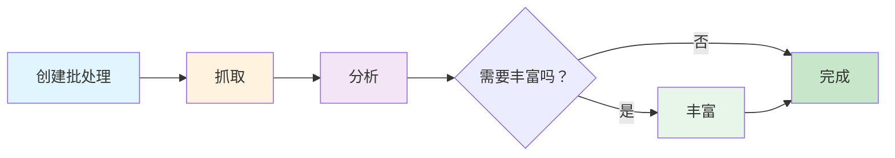

## 介绍

AirOps Batches 提供自动化的页面元数据提取，并通过 LLM 进行丰富。提交 URL 后，您将收到结构化数据，包括页面分类、作者信息、发布日期和品牌提及。

**主要功能：**
- 自动页面类型分类
- 作者和日期提取
- 从您提供的列表中检测品牌提及
- 智能差距分析以最小化处理时间

## 工作流程阶段

批处理经过三个不同的阶段：

### 阶段 1: 抓取
抓取并解析 URL 以提取结构化数据。

### 阶段 2: 分析
差距分析确定哪些字段需要额外提取。数据完整的项目跳过丰富过程。

### 阶段 3: 丰富
通过 LLM 处理缺失字段的项目以进行额外提取。

## 目标模式

系统为每个 URL 提取以下字段：

| 字段 | 类型 | 描述 |
|-------|------|-------------|
| `page_type` | string | 页面内容的分类 |
| `author` | string | 内容的作者（如果有） |
| `date_published` | string | 发布日期（如果有） |
| `date_modified` | string | 最后修改日期（如果有） |
| `brand_mentions` | array | 页面上找到的您列表中的品牌 |

## 页面类型

`page_type` 字段将页面分类为以下类别之一：

<Accordion title="查看所有页面类型">
- `homepage` - 网站的主登陆页面
- `product_page` - 单个产品的功能/定价
- `collection_page` - 多个产品的集合
- `pricing_page` - 专门的定价层页面
- `informational_article` - 标准博客/信息内容
- `documentation` - 技术参考，API 文档
- `listicle_article` - "最佳"，"前 X" 排名列表
- `comparison_page` - 并排比较
- `support_article` - 常见问题，故障排除，帮助内容
- `review_page` - 产品/服务评测及评分
- `forum_thread` - 社区讨论或问答
- `social_media_post` - 单个社交帖子
- `social_media_profile` - LinkedIn/Twitter/Instagram 个人资料页面
- `video_page` - YouTube, Vimeo, 视频内容
- `news_article` - 及时新闻或新闻报道
- `case_study` - 客户成功案例
- `marketplace_listing` - 电子商务产品列表
- `landing_page` - 活动/转化页面（非主页）
- `deal_page` - 折扣，促销，联盟交易
- `job_posting` - 职位列表和职业页面
- `other` - 未分类
</Accordion>

## API 端点

| 方法 | 端点 | 描述 |
|--------|----------|-------------|
| POST | `/v1/batches-airops` | 创建新批处理 |
| GET | `/v1/batches-airops/:batch_id` | 获取批处理状态 |
| GET | `/v1/batches-airops/:batch_id/items` | 获取所有带结果的项目 |