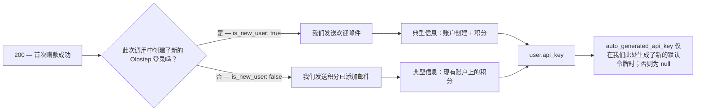

## 概述

合作伙伴用户快速连接是一个单一的 `POST` 请求，它可以从您已验证的电子邮件中配置或附加一个 Olostep 账户。

**您需要发送的内容**
1. **`X-Partner-Key`** — Olostep 提供给您的合作伙伴密钥（用于验证您的集成）。
2. **`Idempotency-Key`** — 您选择的一个值，以确保重试和重放是安全的（完整规则请参见 OpenAPI **描述**）。
3. 包含 **`verified_email`** 的 **JSON body** — 终端用户的地址，`Content-Type: application/json`。

**我们这边可能发生的情况**

- **`200` 成功** — 我们解决或创建用户，运行一次性合作伙伴促销赠款（如果符合条件），并返回 ID、在此次调用中应用的积分、消息和 API 密钥元数据（如果相关）。这包括 **首次赠款**（正数 **`applied_quick_connect_credits`**）、**已领取**（积分 `0`，无重复赠款），以及 **幂等重放**（相同密钥 + 相同电子邮件返回存储的成功响应）。
- **客户端错误** — 例如，如果合作伙伴密钥错误或缺失，则为 **`401`**，如果验证问题则为 **`400`**，如果相同的幂等密钥仍在处理中则为 **`409`**，如果您使用与首次请求不同的电子邮件重用幂等密钥则为 **`422`**。
- **服务器错误** — **`500`** 当我们接受工作后出现故障（例如积分赠款）；当响应不明确时，使用相同的 `Idempotency-Key` 重试是合适的。

查看此页面上的 OpenAPI 面板以获取示例请求、响应和一个用于尝试快速连接端点的交互式操场。

---

## 用户看到的内容

在成功的 **`200`** 之后，使用 JSON 向客户提供我们生成的 API 密钥，并了解 **Olostep 是否在此次调用中向他们发送了事务性电子邮件**（以及使用了哪个模板）。

### API 访问和仪表板

客户可以在您获得密钥后立即调用 Olostep 的 API — 不需要 Olostep 网站或仪表板即可使用 API。当 **`user.api_key.auto_generated_api_key`** 为 **非空** 时，提供给他们（我们在此次赠款中生成了一个默认令牌）；当它为 **`null`** 时，他们已经有令牌或此处未创建新的默认令牌 — 他们可以使用其他密钥或在仪表板中管理密钥（参见 OpenAPI 示例）。

快速连接用户 **不会收到初始仪表板密码**。事务性电子邮件包括 **设置您的仪表板密码**（身份验证“忘记密码”流程）仅用于 **登录仪表板** — 与您从后端传递的密钥进行 API 访问分开。

### 阅读 `200` 响应体

| 字段 | 告诉您的信息 |
|-------|-------------------|
| **`applied_quick_connect_credits`** | **正数** — 此次调用中该用户的首次合作伙伴赠款：应用了促销积分，并发送了 **仅一封** 事务性电子邮件（参见下文 **事务性电子邮件**）。**`0`** — 无新赠款（通常为 **已领取**）：此次响应中 **无** 欢迎或 **合作伙伴积分已添加** 邮件；**`user_message`** 描述了这一点；**`user.api_key.auto_generated_api_key`** 为 **`null`**。 |
| **`user.is_new_user`** | 当积分为 **正数** 时有意义：**`true`** → **欢迎来到 Olostep**；**`false`** → **合作伙伴积分已添加**。 |
| **`user.api_key.auto_generated_api_key`** | 设置时传递给客户；否则依赖现有令牌/仪表板。 |
| **`user_message`** | 您的 UI 的简短结果文本。 |
| **幂等重放** | 相同的 **`Idempotency-Key`** + **`verified_email`** 返回原始赠款的 **存储** 成功响应体 — 以相同方式从该负载中推断电子邮件和密钥。 |

### 事务性电子邮件

仅当 **`applied_quick_connect_credits`** 为 **正数** 时。**`user.is_new_user`** 选择模板：

两个模板都告诉客户 **您** 提供 Olostep API 密钥，以便他们可以在不先访问 Olostep 的情况下开始使用，并且它们包括用于 UI 访问的仪表板密码设置。

| 模板 | 何时（`is_new_user`） | 客户看到的内容 |
|----------|----------------------|-------------------------|
| **欢迎来到 Olostep** | **`true`** | 合作伙伴名称，积分行，**如何访问**（来自合作伙伴的密钥），可选的仪表板链接，设置密码的 CTA。 |
| **合作伙伴积分已添加** | **`false`** | 对于 **现有** Olostep 登录，采用相同的积分和访问模式。 |

**欢迎来到 Olostep**（新用户）：

**合作伙伴积分已添加**（现有用户）：

---

## 附录

### 完整的端到端流程

从入口到幂等性、配置、附属声明和积分赠款的决策路径（与 OpenAPI 合约行为相同）。

```mermaid
flowchart TB
  subgraph ingress [您的请求]
    R[POST + verified_email]
    H[X-Partner-Key + Idempotency-Key]
  end

  ingress --> V{合作伙伴密钥有效吗？}
  V -->|否| E401[401 invalid_partner_key]
  V -->|是| I{幂等性槽}
  I -->|重放相同参数| REP[返回存储的 200 响应体]
  I -->|重放不同的电子邮件| E422[422 idempotency_key_reuse]
  I -->|进行中| E409[409 idempotency_key_in_progress]
  I -->|新槽| P[配置用户 + 应用数据 + 如果需要则生成令牌]

  P --> C{此客户的促销已领取？}
  C -->|是| Z[200 — 积分 0，已领取]
  C -->|否| W{赢得声明竞争？}
  W -->|输掉竞争| Z
  W -->|赢得| CR[授予合作伙伴促销积分]
  CR -->|失败| E500[500 — 重试]
  CR -->|成功| OK[200 — 首次赠款]

  REP --> DONE([您的后端])
  Z --> DONE
  OK --> DONE
  E401 --> DONE
  E422 --> DONE
  E409 --> DONE
  E500 --> DONE
```

